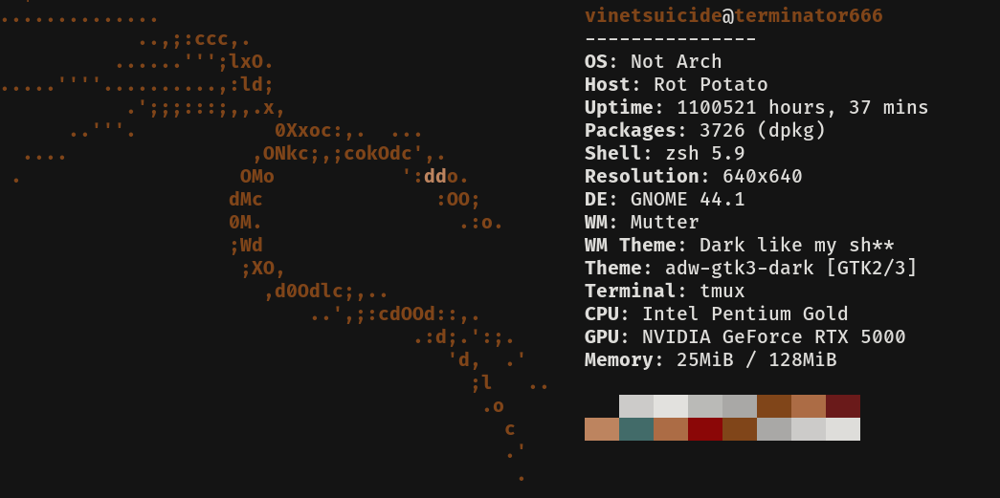
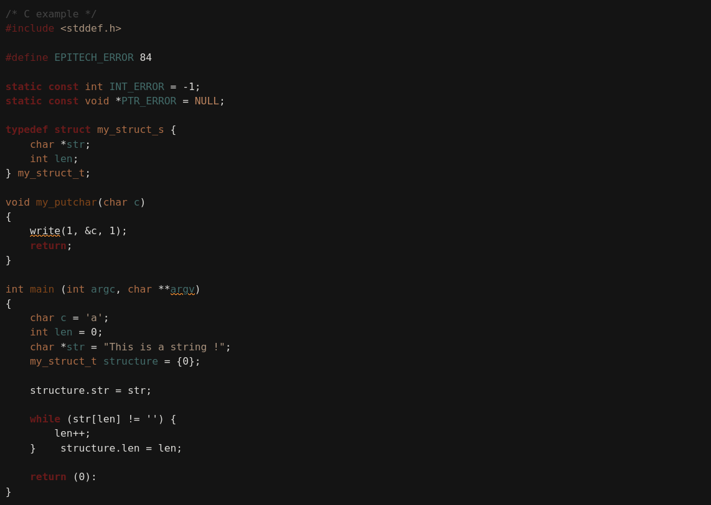

 Ethercopper!

**Ethercopper** </br>
is an enchanting theme designed to elevate your coding experience in both the GNOME Terminal and Vim. Immerse yourself in the harmonious blend of ethereal atmospheres and warm metallic tones, creating a coding environment that is both visually appealing and conducive to productivity.




## Features

- **Ethereal Atmosphere:** The theme brings a touch of the otherworldly to your coding environment, with a palette inspired by celestial whispers and mystical landscapes.

- **Warm Metallic Tones:** Copper-infused hues create a cozy and grounded feel, ensuring readability and comfort during long coding sessions.

- **Versatile Design:** Ethercopper is thoughtfully crafted for both the GNOME Terminal and Vim, providing a seamless and consistent experience across your coding tools.

## Installation

1. **GNOME Terminal:**
  ```
chmod +x Ethercopper.sh
./Ethercopper.sh
  ``` 
2. **Vim:**
   - Install the theme using your preferred Vim package manager or manually by copying the theme file to your Vim configuration directory.

## Usage

### GNOME Terminal

1. Open GNOME Terminal.
2. Navigate to Preferences > Profiles > Colors.
3. Import the downloaded Ethercopper theme file.
4. Select Ethercopper from the list of available profiles.

### Vim

1. Ensure you have a Vim plugin manager installed (e.g., Vundle, Pathogen, or Vim-Plug).
2. Add the following line to your Vim configuration:
   ```vim
   Plugin 'user/repo' " Add the link to your Ethercopper Vim theme repository

    Reload Vim or restart it, then run :PluginInstall to install the Ethercopper theme.

Contribution

Feel free to contribute by reporting issues, suggesting improvements, or creating pull requests. Your feedback is highly appreciated!
License

This theme is licensed under the MIT License.


Replace the placeholder links with the actual links to your theme preview image, GNOME Terminal theme files, Vim theme repository, and license file. Customize the content further if needed.

